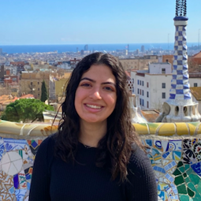
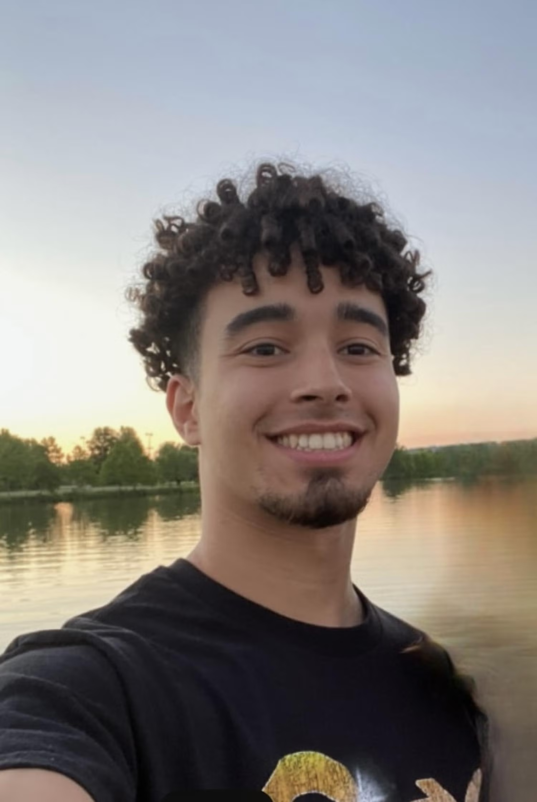
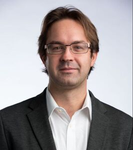
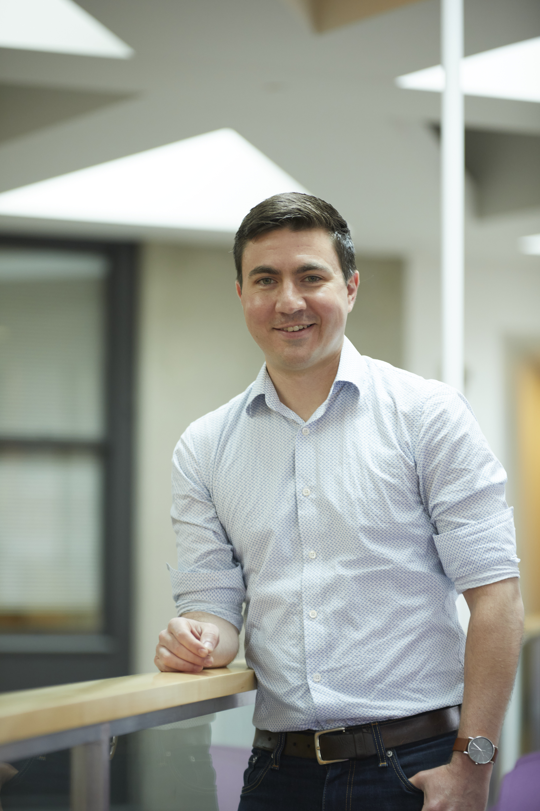

# Meet the Team

Our team consists of passionate and driven individuals working towards the future of synthetic biology. Below is a brief introduction to our team members and their research interests.

## Team Members

### Graduate Students

  

    <strong>Logan Barrios</strong> 
    

       
    

    <a href="https://www.linkedin.com/in/logan-barrios-a7b141191/">LinkedIn</a> 
    Research Interests:
  

  

    <strong>Pedro Lemos</strong> 
    

       
    

    <a href="https://www.linkedin.com/in/pedro-albuquerque-lemos/">LinkedIn</a> 
    Research Interests:
  

  

    <strong>Zachary Caterer</strong> 
    

       
    

    <a href="http://caterer-z-t.github.io">Website</a> | <a href="https://www.linkedin.com/in/zacharytcaterer/">LinkedIn</a> 
    Research Interests:
  

### Primary Investigators

  

    <strong>Dr. Richard Benninger</strong> 
    

       
    

    <a href="https://www.benningerlab.com/">Website</a> | <a href="https://www.linkedin.com/in/richard-benninger-451a083/">LinkedIn</a> 
    Research Interests:
  

  

    <strong>Dr. Stephen Kissler</strong> 
    

       
    

    <a href="https://kisslerlab.github.io/people/StephenKissler/">Website</a> | <a href="https://www.linkedin.com/in/stephen-kissler-1704a4182/">LinkedIn</a> 
    Research Interests:
  

---

Click on a team member's image to see more details about their research interests and contributions.