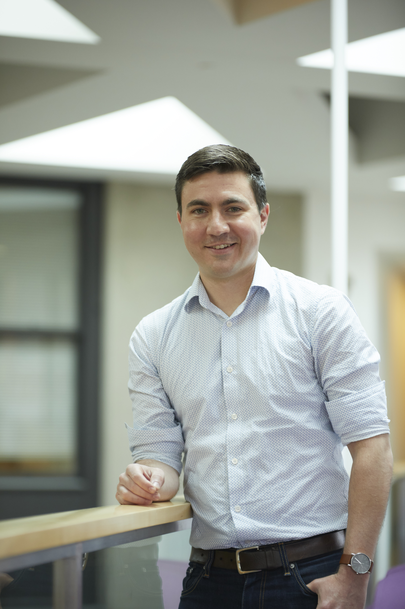

<head>
  <link rel="stylesheet" href="https://cdnjs.cloudflare.com/ajax/libs/font-awesome/6.0.0/css/all.min.css">
  
</head>

# Meet the Team

Our team consists of passionate and driven individuals working towards the future of synthetic biology. Below is a brief introduction to our team members and their research interests.

## Team Members

### Graduate Students

  <!-- Logan Barrios -->
  

    <a href="logan.html">
      <strong>Logan Barrios</strong> 
      
    </a>
     
    

      <a href="https://www.linkedin.com/in/logan-barrios-a7b141191/" target="_blank">
        <i class="fa-brands fa-linkedin" style="font-size: 24px;"></i>
      </a>
    

    
Research Interests:

  

  <!-- Pedro Lemos -->
  

    <a href="pedro.html">
      <strong>Pedro Lemos</strong> 
      
    </a>
     
    

      <a href="https://www.linkedin.com/in/pedro-albuquerque-lemos/" target="_blank">
        <i class="fa-brands fa-linkedin" style="font-size: 24px;"></i>
      </a>
    

    
Research Interests:

  

  <!-- Zachary Caterer -->
  

    <a href="zac.html">
      <strong>Zachary Caterer</strong> 
      
    </a>
     
    

      <a href="http://caterer-z-t.github.io" target="_blank">
        <i class="fa-solid fa-globe" style="font-size: 24px;"></i>
      </a>
      <a href="https://www.linkedin.com/in/zacharytcaterer/" target="_blank" style="margin-left: 10px;">
        <i class="fa-brands fa-linkedin" style="font-size: 24px;"></i>
      </a>
    

    
Research Interests:

  

### Primary Investigators

  

  <a href="richard.html" >
    <strong>Dr. Richard Benninger</strong> 
       
    </a>
     
    

      <a href="https://www.benningerlab.com/" target="_blank">
        <i class="fa-solid fa-globe" style="font-size: 24px;"></i>
      </a>
      <a href="https://www.linkedin.com/in/richard-benninger-451a083/" target="_blank" style="margin-left: 10px;">
        <i class="fa-brands fa-linkedin" style="font-size: 24px;"></i>
      </a>
    

    
Research Interests:

  

  

  <a href="stephen.html" >
    <strong>Dr. Stephen Kissler</strong> 
       
    </a>
     
    

      <a href="https://kisslerlab.github.io/people/StephenKissler/" target="_blank">
        <i class="fa-solid fa-globe" style="font-size: 24px;"></i>
      </a>
      <a href="https://www.linkedin.com/in/zacharytcaterer/" target="_blank" style="margin-left: 10px;">
        <i class="fa-brands fa-linkedin" style="font-size: 24px;"></i>
      </a>
    

    
Research Interests:

  

*Click on a team member's image to see more details about their research interests and contributions.

